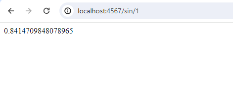
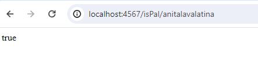
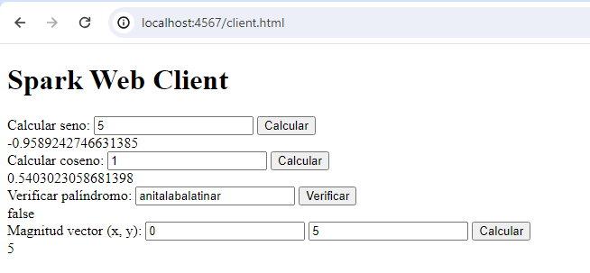
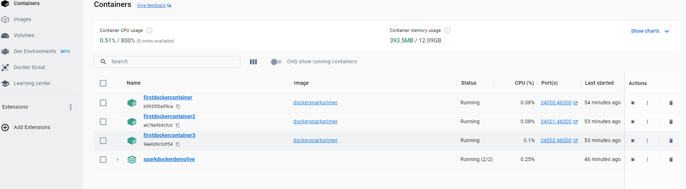

# Laboratorio 4 - AREP

## Descripción

Este proyecto consiste en la implementación de un servidor web en Java con Spark, que puede manejar solicitudes HTTP y proporcionar servicios REST para calcular funciones matemáticas y verificar si una cadena es un palíndromo. Además, se incluye un cliente web para interactuar con estos servicios.
Enfocandoce así, en la modularización mediante la virtualización utilizando Docker y AWS. La aplicación desarrollada es una pequeña aplicación web utilizando el micro-framework Spark Java. Posteriormente, se construye un contenedor Docker para la aplicación y se despliega localmente. Luego, se crea un repositorio en DockerHub y se sube la imagen del contenedor. Finalmente, se despliega el contenedor en una máquina virtual en AWS. El taller consta de las siguientes partes:

### Creación de la aplicación web

- Se crea un proyecto Java utilizando Maven.
- Se importan las dependencias de Spark Java en el archivo `pom.xml`.
- Se asegura que el proyecto compile correctamente.
- Se ejecuta la aplicación para verificar su funcionamiento en `http://localhost:4567/hello`.

### Creación de la imagen Docker y despliegue local

- Se crea un archivo `Dockerfile` para construir la imagen Docker.
- Se utiliza Docker CLI para construir la imagen y verificar su creación.
- Se ejecutan múltiples instancias del contenedor Docker y se verifica que estén corriendo.
- Se usa `docker-compose` para automatizar la configuración de los contenedores.
- Se verifica que los servicios se hayan creado correctamente.

### Subida de la imagen a Docker Hub

- Se crea una cuenta en Docker Hub y se verifica el correo.
- Se crea un repositorio en Docker Hub.
- Se etiqueta la imagen local con el nombre del repositorio en Docker Hub.
- Se autentica en Docker Hub y se sube la imagen.
- Se verifica que la imagen esté disponible en Docker Hub.

## Arquitectura del Proyecto

El proyecto sigue una arquitectura cliente-servidor, donde el servidor Spark actúa como el servidor que escucha las solicitudes entrantes de los clientes y procesa las solicitudes. El cliente web envía solicitudes HTTP al servidor para realizar cálculos matemáticos o verificar si una cadena es un palíndromo.

## Generación de Imágenes para Desplegar

Para generar la imagen Docker, se utiliza el `Dockerfile` proporcionado en la raíz del proyecto. Se construye la imagen utilizando el comando `docker build`. Luego, se ejecutan múltiples instancias del contenedor Docker con `docker run`, y se verifica su funcionamiento accediendo a las rutas especificadas en el navegador.

## Estructura del Repositorio

El repositorio contiene el código fuente del proyecto, que está estructurado y gestionado utilizando Apache Maven.

### Componentes Principales

1. **Servidor Spark**: Representa el servidor web principal que maneja las solicitudes HTTP entrantes y proporciona servicios REST.
2. **Controladores Spark**: Funciones lambda que procesan las solicitudes HTTP y generan respuestas dinámicas para calcular funciones matemáticas y verificar palíndromos.
3. **Cliente Web**: Interfaz de usuario que permite al usuario interactuar con los servicios REST proporcionados por el servidor Spark.

## Ejemplo de Uso

- A continuación se muestra un ejemplo de cómo se desarrollarían las aplicaciones en este servidor Spark:

    ```java
    // Controlador para calcular el seno
    get("/sin/:value", (req, res) -> {
        double value = Double.parseDouble(req.params(":value"));
        return Math.sin(value);
    });
    ```

- Un ejemplo de una solicitud GET para calcular el seno: \
  
- Un ejemplo de una solicitud GET para verificar si una cadena es un palíndromo: \
  
- Un ejemplo de la interfaz: \
  
- Containers construidos:  \
  
- Desplegue realizado: \
  

## Instrucciones de Ejecución

Para ejecutar el proyecto, sigue estos pasos:

1. Clona el repositorio desde GitHub.
2. **Compilar el Proyecto:** Ejecutar `mvn compile`.
3. **Ejecutar el Servidor Spark:** Ejecutar `java -cp "target/classes;target/dependency/*" co.edu.escuelaing.sparkdockerdemolive.SparkWebServer`.
4. **Acceder al Cliente Web:** Entrar desde un navegador a `http://localhost:4567/client.html`.

Para ejecutar el container:

1. Inice e ingrese a su perfil de dockerDesktop
2. Realice un pull de la imagen `tianrojas/taller5.arep:latest`
3. **Cree un container con dicha imagen** Ejecutar `docker run -d -p 34000:46000 --name firstdockercontainer tianrojas/taller5.arep`
4. **Acceder al Cliente Web:** Entrar desde un navegador a `http://localhost:34000/client.html`

